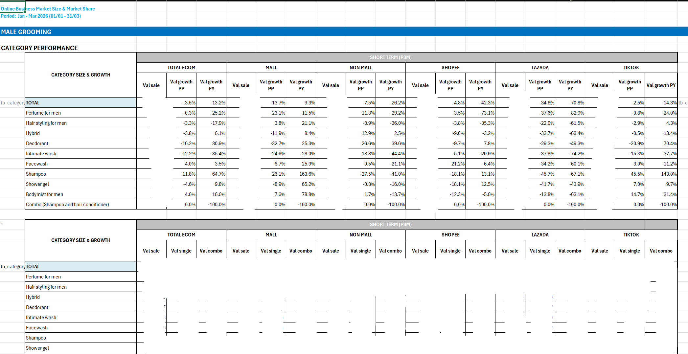
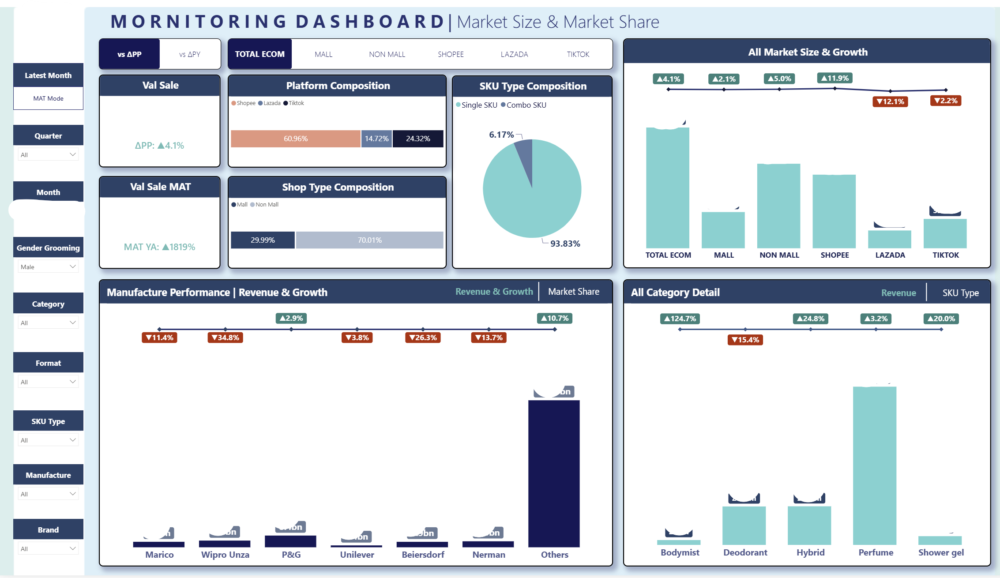
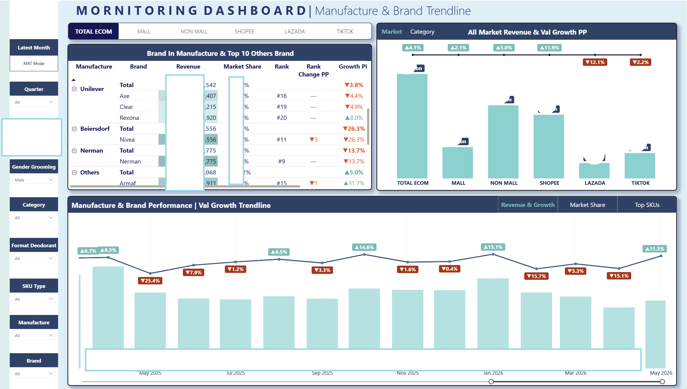
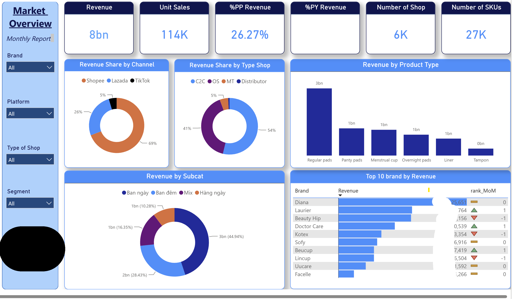
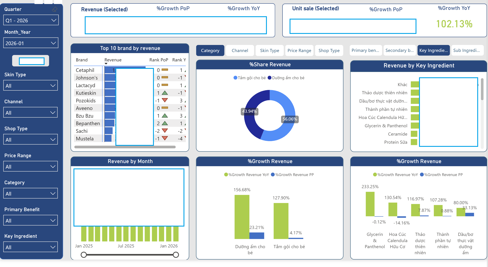
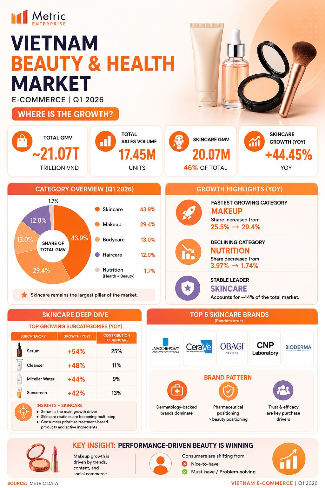

# FMCG E-Commerce Market Research Data Project

> **Role:** Full-Stack Data Analyst (End-to-End Execution)  
> **Domain:** FMCG E-Commerce (Shopee, Lazada, TikTok Shop)  
> **Scope:** Stakeholder Management → Data Engineering (ETL) → LLM-based Tagging → Data Validation → Automated Reporting  

---

## 1. Business Context & Project Scope

In the highly competitive Fast-Moving Consumer Goods (FMCG) sector, brands need precise, granular data to track market share, monitor competitors, and claim category leadership. However, raw marketplace data is incredibly messy—lacking standard taxonomies, full of abbreviations, and mixed with unstructured text.

For this project, I owned the end-to-end data pipeline to transform chaotic marketplace data into standardized, actionable market intelligence. 

**Scale & Impact:**
- **Clients Served:** 5 major enterprise clients.
- **Category Scope:** 15 distinct product groups across **Men's Care, Female Care, and Baby Care**.
- **Data Coverage:** Historical data pulls ranging from 1 to 3 years, plus monthly/quarterly recurring tracking.

---

## 2. Downstream Applications (How the Data is Used)

The standardized data mart I engineered serves as the single source of truth for critical business deliverables.

### 1. Automated Excel Reports
Granular, cross-tabulated data delivered directly to client business teams.

  

### 2. Interactive Dashboards (Power BI)
Visualized market share trends, competitor performance, and brand health metrics for granular category analysis.

  <h4>Men's Care Market Overview</h4>
  
    
  <h4>Brand Tracking & Trendline Analysis</h4>
  
    
  <h4>Female Care Market Overview</h4>
  
    
  <h4>Baby Care Market Overview</h4>
  

### 3. Market Certificates
Verified and audited data used to issue official "Market Certificates", certifying a client's brand or product as the #1 Top Seller in a specific category or niche.

  

### 4. Market Intelligence & PR Reports
Serving as the foundation for thought-leadership articles, whitepapers, and B2B advertising reports published on LinkedIn, Facebook, and [Brands Vietnam](https://www.brandsvietnam.com/marketer/metric/).

  

---

## 3. Key Responsibilities & Technical Achievements

**Stakeholder Management & Requirements Scoping**
- Collaborated with BD and Sales teams to engage client stakeholders, gather reporting requirements, and define product category scopes.
- Aligned on final deliverable formats tailored to specific FMCG niches and served as the primary point of contact for data delivery and ad-hoc requests.

**Big Data Processing & Hybrid AI Tagging**
- Extracted large-scale raw SKU data from Shopee, Lazada, and TikTok Shop using ClickHouse.
- Built a Hybrid Tagging Engine (Rule-based + Azure OpenAI GPT) to automatically classify complex product listings into customized client taxonomies (Category, Gender, Brand, Product Line, Ingredient, Benefit).
- Normalized revenue attribution across multi-variant SKUs to ensure market share calculations were mathematically sound.

**Data Warehouse Automation & Incremental Validation**
- Automated the master database refresh, generating structured Fact and Dimension views to seamlessly feed normalized data into Excel and Power BI.
- Authored strict data validation test cases (see [`demo_test_case.ipynb`](01_DataTransform/src/demo_test_case.ipynb)) covering untagged brand volume spikes, MoM revenue drift, new market entrants, and cross-period data conflicts before any data reached the client.

---

## 4. Repository Structure

- 📂 **`/01_DataTransform`**: Contains the pipeline architecture (`ARCHITECTURE.md`), functional requirements (`REQUIREMENTS.md`), and the scope for the Hybrid LLM Tagging Engine. *(Also includes `src/demo_test_case.ipynb` demonstrating the automated QA logic).*
- 📂 **`/02_Output_ExcelReport`**: Examples of automated deliverable templates and structured output formats.
- 📂 **`/03_Output_Dashboard`**: Visual representations of the dashboards used by clients to track category trends.
