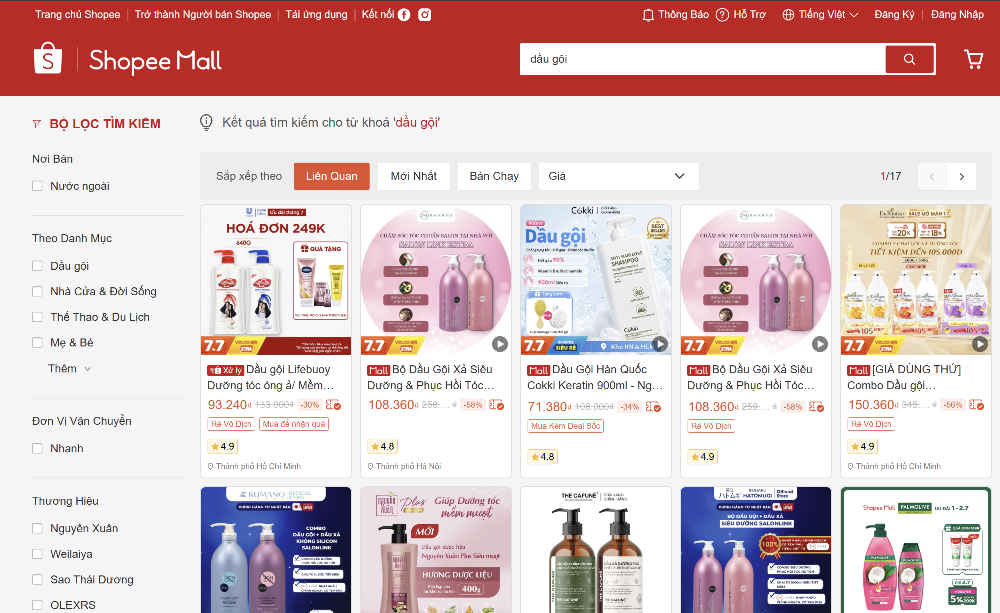
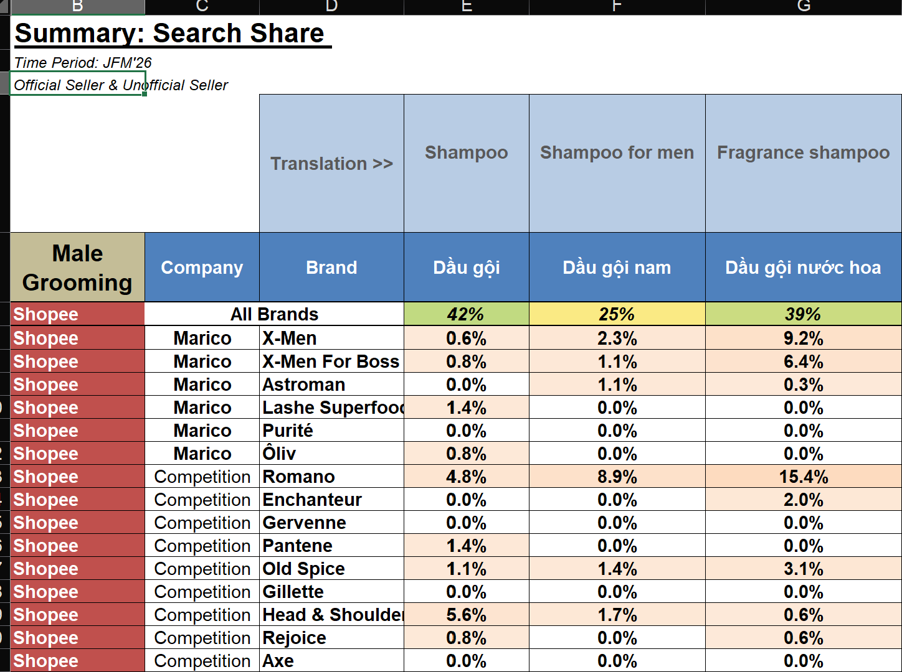

# Keyword Search Share Tracker

> **Role:** Initiator & End-to-end Owner  
> **Tech Stack:** JavaScript (Browser DevTools) · Python (asyncio, asyncpg) · PostgreSQL  
> **Status:** In production — actively used for FMCG client reporting

---

## Business Context

In the FMCG e-commerce space, understanding **keyword search share** — the percentage of search results a brand occupies for high-intent keywords — is critical for evaluating brand visibility and competitive positioning.

Native analytics dashboards on Shopee and Lazada do **not** provide search share metrics at the keyword level. This project was **proposed and built from scratch** to fill that gap, enabling clients to:

- See how their products rank against competitors for each target keyword.
- Track brand visibility trends over time (monthly/quarterly).
- Identify keyword gaps where competitors dominate and optimize search presence.
- **Optimize SEO & Product Naming:** Guide brands on renaming their product listings (SKUs) to align with actual search behavior, drastically improving organic ranking.
- **Validate against "Hot Keywords":** Combine with Metric's built-in Hot Keyword Tool to verify if a partner's products successfully capture traffic from the market's most trending and high-volume search terms.

### Visual Concept



## Architecture

```
┌─────────────────────────────────────────────────────────────┐
│  Stage 1: Data Collection (JavaScript — Browser DevTools)   │
│                                                             │
│  JS snippets run inside the browser console to intercept    │
│  platform API responses for 31 target keywords per run.     │
│                                                             │
│  ┌─────────────────┐  ┌──────────────────┐                  │
│  │ shopee_search_   │  │ shopee_mall_     │                  │
│  │ snippet.js       │  │ snippet.js       │                  │
│  │ (All Shopee)     │  │ (Shopee Mall)    │                  │
│  └────────┬────────┘  └────────┬─────────┘                  │
│           │                    │                             │
│  ┌────────┴────────────────────┴─────────┐                  │
│  │         lazada_snippet.js             │                  │
│  │         (Lazada — via AJAX API)       │                  │
│  └────────────────┬──────────────────────┘                  │
│                   │                                         │
│                   ▼                                         │
│          JSON files (per platform per date)                 │
└─────────────────────┬───────────────────────────────────────┘
                      │
┌─────────────────────▼───────────────────────────────────────┐
│  Stage 2: Data Ingestion (Python — asyncio + asyncpg)       │
│                                                             │
│  shopee_import_from_json.py                                 │
│  - Parses all-in-one JSON → normalizes keywords             │
│  - Deduplicates by product_base_id per keyword              │
│  - Async batch inserts into PostgreSQL                      │
│  - Idempotent: ON CONFLICT DO NOTHING                       │
└─────────────────────┬───────────────────────────────────────┘
                      │
┌─────────────────────▼───────────────────────────────────────┐
│  Stage 3: Analysis & Reporting                              │
│                                                             │
│  Template (1_Template/) → populated with query results      │
│  → Output (3_Output/) — Excel report with search share %    │
│  per keyword, per brand, per platform                       │
└─────────────────────────────────────────────────────────────┘
```

---

## Project Structure

```
Keyword Search Share Tracker Project/
│
├── 1_Template/
│   ├── Shopee Search Share - Template.xlsx    # Report template
│   └── Shopee Search Share - Output 2026Q1.xlsx  # Sample output
│
├── 2_Code/
│   ├── shopee_search_snippet.js    # Crawl all Shopee search results
│   ├── shopee_mall_snippet.js      # Crawl Shopee Mall (official stores)
│   ├── lazada_snippet.js           # Crawl Lazada search results via AJAX
│   └── shopee_import_from_json.py  # Parse JSON → PostgreSQL ingestion
│
├── 3_Output/
│   ├── shopee_search_all_keywords_*.json      # Raw crawled data
│   ├── shopee_mall_all_keywords_*.json        # Raw crawled data
│   ├── lazada_all_keywords_*.json             # Raw crawled data
│   └── Shopee Search Share - Output 2026Q1.xlsx  # Final report
│
└── README.md
```

---

## How It Works

### 1. Data Collection (JavaScript)

The crawling approach uses **browser DevTools console snippets** rather than traditional HTTP scraping. This technique:

- Runs inside an authenticated browser session (avoids CAPTCHA and auth blocks).
- **Intercepts the platform's own API responses** instead of calling `fetch()` directly (for Shopee).
- Uses Lazada's internal AJAX API with CSRF token extraction.
- Implements **localStorage caching** — if the browser crashes mid-crawl, progress is preserved and resumed automatically.
- Adds **randomized delays** (3–7s between keywords) to respect rate limits.

**Platforms covered:**

| Script | Platform | Method | Keywords |
|--------|----------|--------|----------|
| `shopee_search_snippet.js` | Shopee (all sellers) | Intercept `searchItems` API response | 31 |
| `shopee_mall_snippet.js` | Shopee Mall (official stores) | Intercept `searchItems` API response | 31 |
| `lazada_snippet.js` | Lazada | Direct AJAX API call with CSRF token | 31 |

### 2. Data Ingestion (Python)

`shopee_import_from_json.py` handles the ETL from JSON → PostgreSQL:

- **Keyword normalization**: Standardizes casing across all keywords.
- **Deduplication**: Removes duplicate products per keyword using `product_base_id`.
- **Async batch processing**: Uses `asyncpg` with connection pooling for high-throughput inserts.
- **Idempotent writes**: `ON CONFLICT DO NOTHING` ensures re-runs don't create duplicates.

### 3. Reporting

- A pre-built **Excel template** (`1_Template/`) defines the report structure.
- Query results from PostgreSQL populate the template to produce the final **Search Share Report** — showing each brand's visibility percentage per keyword.

---

## Key Technical Highlights

| Feature | Detail |
|---------|--------|
| **API Interception** | Hooks into Shopee's native XHR pipeline instead of making external requests |
| **Fault Tolerance** | localStorage-based checkpoint/resume for multi-keyword crawls |
| **Unicode Handling** | NFC normalization for Vietnamese keyword consistency |
| **Async I/O** | `asyncio` + `asyncpg` connection pooling for parallel DB writes |
| **Idempotent Design** | `UNIQUE` constraint + `ON CONFLICT DO NOTHING` for safe re-runs |

---

## Setup

### Prerequisites

- Python 3.10+
- PostgreSQL database
- Chrome or Edge browser (for JS snippets)

### Environment Variables

Create a `.env` file or set environment variables:

```bash
DB_USER=your_user
DB_PASSWORD=your_password
DB_HOST=your_host
DB_PORT=5432
DB_NAME=your_database
```

> **⚠️ Note:** Never commit database credentials to version control.
> The code in this portfolio uses environment variables for all sensitive configuration.

### Install Dependencies

```bash
pip install asyncpg python-dotenv
```

---

## Sample Output

The final deliverable is an Excel report showing **search share by keyword and brand**:

| Keyword | Brand A (%) | Brand B (%) | Brand C (%) | Others (%) |
|---------|-------------|-------------|-------------|------------|
| Dầu gội nam | 23.3% | 16.7% | 13.3% | 46.7% |
| Sữa tắm | 20.0% | 13.3% | 10.0% | 56.7% |
| Xịt khử mùi | 30.0% | 20.0% | 6.7% | 43.3% |

*Brand names anonymized for confidentiality.*

---

## Related Projects

| Project | Relationship |
|---------|-------------|
| FMCG Market Research Pipeline | Search share data supplements market research reports as a competitive intelligence layer |
| MCN Dashboard | Similar data collection approach (platform API interception) applied to different domain |

---

## License

This project is part of a professional portfolio. Code is shared for demonstration purposes.  
Data and brand names have been anonymized. Do not use crawling scripts for unauthorized data collection.
