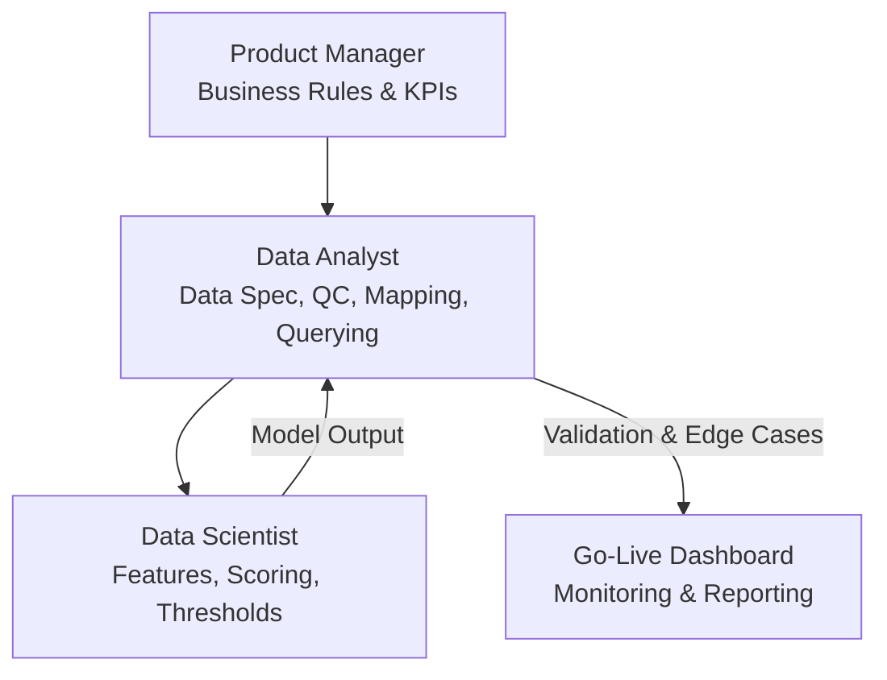

# Logistics & Fintech COD Credit Scoring Model

> **Role:** Technical Data Analyst / Bridge Analyst  
> **Tech Stack:** SQL · Metabase · Data Mapping · Dashboard Mockup  
> **Domain:** Logistics & Fintech (Credit Scoring)
> 
> *Note: All files in this repository have been anonymized to protect the intellectual property and confidentiality of the partner company. Partner names, actual production schemas, and proprietary scoring logic have been removed or replaced with generic placeholders.*

---

## 1. Business Context

A major national logistics partner offering Cash-on-Delivery (COD) services needed a **credit scoring system** to evaluate shop reliability before granting them COD cash-advance limits. The system required:

- **Shop Profile Data:** Operational duration, scale, and historical order fulfillment rates.
- **Daily Order Logs:** COD vs. Non-COD volume, delivery success/return/cancellation rates, and total transaction values.
- **Credit Scoring Model:** Thresholds to categorize customers (Eligible / Under Review / Rejected) and assign dynamic credit limits.
- **Operational Dashboard:** A real-time monitoring tool for Product Managers (PM), Data Scientists (DS), and the deployment team to track risk during the rollout phase.

---

## 2. My Role (Bridge Analyst)

In this project, I acted as the crucial bridge between **Business Operations (PM)**, **Data Science (DS)**, and **Production Data Engineering**. My focus was on data architecture, data validation, and deployment tooling, ensuring the ML model aligned perfectly with real-world business logic.

### Core Responsibilities

- **Business Requirement Translation (with PM):** Gathered business rules and translated them into actionable data requirements, defining metrics, update frequencies, and dashboard KPIs.
- **Data Field Specification:** Authored comprehensive Data Dictionaries detailing shop profiles, order logs, and aggregated metrics (data types, sources, and transformation logic).
- **Cross-functional Verification (with DS):** Verified feature engineering logic and scoring thresholds against real production data. Reconciled model outputs with business rules and flagged edge cases.
- **Data Quality Control:** Monitored data completeness, consistency, and drift. Validated the technical mapping from raw ingestion tables to the final analytical schema.
- **Onsite Querying & Validation:** Used Metabase/SQL to query the live production environment, validating data specs and troubleshooting anomalies before model go-live.
- **Go-Live Dashboard Mockup:** Designed metric layouts and wireframes for the operational dashboard, providing stakeholders with clear visibility into COD order distribution and risk profiles.

---

## 3. Project Workflow (PM ↔ DA ↔ DS)

### Data Validation Checklist
To ensure the Data Science team had reliable features, I established a strict QC gate:
1. Validated daily/monthly data volume against PM expectations.
2. Checked for duplicate or missing unique identifiers (Shop ID, Order ID).
3. Monitored NULL rates and extreme outliers on critical scoring features.
4. Ensured consistency between aggregated metrics and drill-down order logs.
5. Spot-checked random samples manually against the pipeline output.

---

## 4. Deliverables Included in this Portfolio

*The following documents have been strictly anonymized and serve as structural demonstrations of my methodology:*

| File | Purpose |
|------|---------|
| `1_Data_Field_Specification.docx` | Data dictionary for aggregated features used in scoring & limits. |
| `2_Raw_Data_Column_Mapping.docx` | Technical mapping from raw data source to deployment schema. |
| `3_Credit_Scoring_Model.xlsx` | Framework for feature weights, formulas, and risk categorization. |
| `4_Shop_Statistics_Baseline.docx` | Baseline market distribution (revenue, volume, return rates). |
| `5_Dashboard_Mockup.pptx` | Wireframes for the deployment operational dashboard. |
| `6_Effort_Estimation.xlsx` | Cross-team task breakdown and effort estimation (DA vs. DE). |

---

## 5. Key Skills Demonstrated

- **Translating Business to Tech:** Turning PM requirements into deployable data specifications.
- **Stakeholder Management:** Coordinating seamlessly between PM (Business), DS (Model), and DE (Pipeline).
- **Production Data Validation:** Conducting rigorous data checking (drift, anomalies) on live data.
- **Dashboard Blueprinting:** Designing operational dashboards focused on rollout phases, not just static reporting.
- **Domain Expertise:** Deep understanding of E-commerce, Logistics, and Fintech credit risk metrics.
