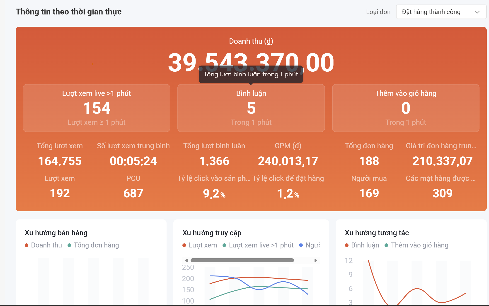
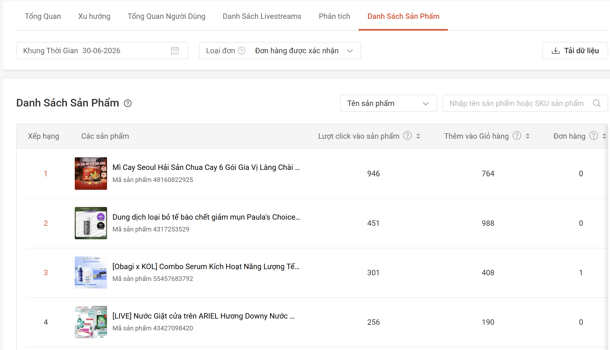
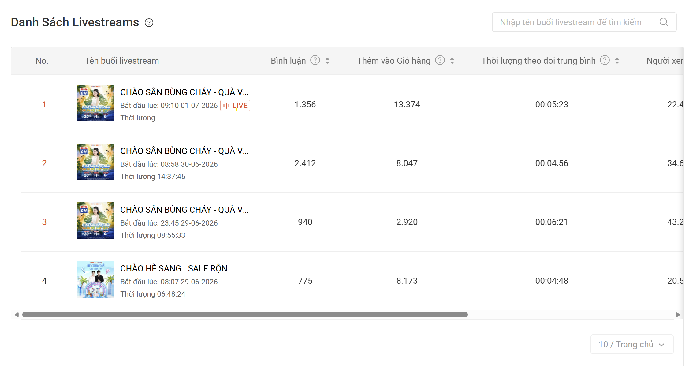
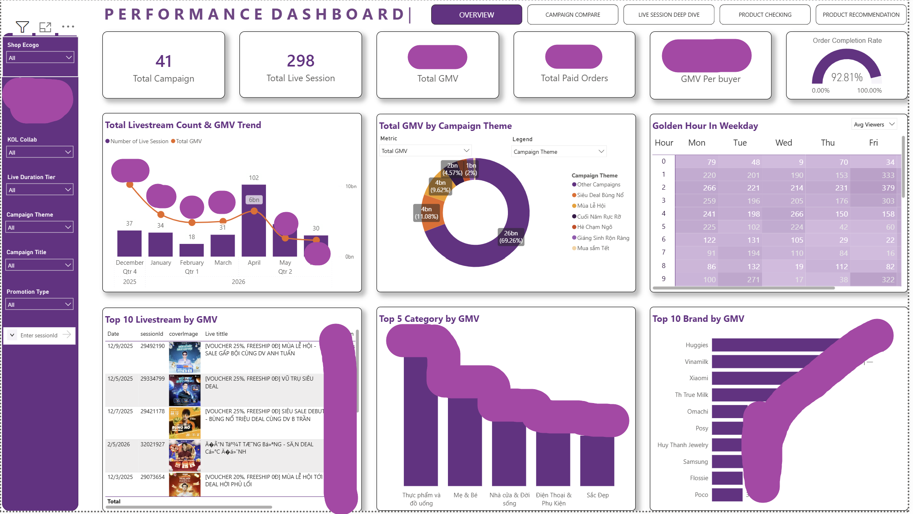

# E-Commerce Livestream Performance Dashboard (Shopee & MCN)

> **Role:** Full-Stack Data Analyst (End-to-End Execution)  
> **Scope:** Data Parsing (Raw JSON) → Database Design → Dashboard UI/UX & Analytical Logic

---

## 1. Business Context & Pain Points

In the rapidly growing e-commerce livestream sector, **MCNs (Multi-Channel Networks)** and Mega-Brands manage dozens of creators and hundreds of live sessions weekly across major platforms like Shopee and TikTok. 

**The Pain Point:** 
Native platform analytics—such as the **Shopee Live Dashboard** and **TikTok Partner Center**—provide data that is heavily fragmented. They force users to look at data on a rigid, **per-session basis**, making it impossible to answer high-level strategic questions.
- They lack data aggregation across multiple campaigns, creators, or channels.
- They do not allow deep-dive analysis into how specific *products* performed across different livestreams over time.
- They offer no competitive insights or product recommendations to optimize the next livestream.

  <i>Fragmented, per-session Native Analytics Views (Pain Point)</i> 
  
  
  

## 2. My Role & The Solution

I owned this project from end to end, building a centralized **Livestream Performance Dashboard** that transforms raw, fragmented API data from these platforms into actionable business intelligence. 

> *Note: While the data pipeline and database schema were engineered to handle both Shopee and TikTok Partner Center data, the UI/UX layouts showcased in this portfolio focus exclusively on the **Shopee MCN Dashboard**, as this module is actively deployed in production for our clients.*

### End-to-End Data Responsibilities:
- **Raw Data Processing & Parsing:** Extracted, cleaned, and parsed complex, heavily nested JSON payloads directly from the Shopee and TikTok backend APIs (e.g., `buyer_profile`, `live_coordinate`).
- **Data Staging & Schema Design:** Engineered the relational database schema and formulated strict Data Staging requirements, mapping unstructured API data into optimized, analytical Data Marts.
- **Data Quality & Outlier Treatment:** Implemented rigorous checks for GMV reconciliation, time-series alignment, and deduplication. Statistically identified and filtered out extreme data outliers (e.g., test orders, bot traffic anomalies) to prevent data skewing in the final dashboard visualizations.
- **UAT & Bug Resolution:** Authored comprehensive test cases and managed QA tickets on Jira, collaborating closely with Data Engineers to debug pipeline failures, fix data discrepancies, and ensure production readiness.

### Key Analytical Features Developed:
1. **Holistic Overview & Aggregation:** Consolidated metrics across all live sessions, hosts, and channels into a single unified view.
2. **Product-Level Deep Dive:** Evaluated the exact ROI and conversion efficiency of specific products deployed during livestreams, answering: *"Which products actually drive GMV when pinned on screen?"*
3. **Market-Driven Product Recommendation:** Built logic to recommend similar or trending products based on historical live performance, allowing MCNs to optimize future product mix. By integrating directly with **Metric's core data ecosystem**, this feature acts as a powerful **Unique Selling Proposition (USP)**. It actively drives demand from our MCN partners, encouraging them to utilize our broader market data and significantly increasing our B2B deal win rates.
4. **Campaign Comparison:** Enabled side-by-side benchmarking of Mega-Campaigns (e.g., 11.11 vs. 12.12) to measure growth and identify top-performing hosts.

---

## 3. Product Tracking & Segmentation Framework

Because MCN livestreams feature dozens of products across different categories, brands, and price points, comparing SKU performance required a standardized evaluation framework. I designed a matrix based on traffic and revenue conversion to segment products efficiently.

### 3.1 Product State Normalization (System Reference)
To ensure fair "apples-to-apples" comparison, products are categorized by their exposure state on the livestream:
- **Only in cart:** The product sits in the livestream cart but is never pinned on screen (`Impressions = 0`, only Clicks).
- **High Focus:** The product is actively pinned and heavily promoted. (Defined statistically as `Total Impressions ≥ 75th percentile` of all products with impressions).
- **Pinned in live:** The product is pinned on screen but receives standard exposure (excludes the High Focus group).

*Products are further normalized by Price Segments and Shopee Level 1 Categories.*

### 3.2 Performance Matrix (The 4 Quadrants)
Using two primary metrics—**Total Clicks** (Traffic) and **GMV per 100 Clicks** (Revenue Efficiency)—products are mapped into four actionable segments:

| Segment | Definition | Actionable Insight |
|---------|------------|--------------------|
| 🏆 **Winning/Hero Products** | Outstanding performance in both traffic (View/Click) and revenue (GMV). | Prioritize these SKUs during "Golden Hours" in future livestreams. Actively source similar products in the market. |
| 💎 **Hidden Gems** | Low traffic (View/Click) but exceptionally high revenue conversion (GMV). | These products lack sufficient screen time. Allocate longer "Pin" durations or push sales harder in the next livestream. |
| 🧲 **High Traffic Products** | High traffic generation (Views/Clicks) but poor revenue conversion. | Ideal "Bait/Hook" products to retain viewership and engagement, but do not rely on them for GMV targets. |
| 🗑️ **Non-Efficiency** | Poor performance in both traffic and revenue. | Phase out from the livestream product mix and replace with better market alternatives. |

### 3.3 Outlier Handling (Anti-Skew Logic)
Because the primary metric is `GMV per 100 Clicks`, the matrix is highly sensitive to product price. A "lucky" order for a high-ticket item (e.g., a smartphone) generated from just 1 accidental click could result in an artificially massive efficiency score, skewing the entire quadrant mapping.
- **The Fix:** Implemented a statistical minimum traffic threshold (e.g., `clicks > N`) and capped outlier GMV values. This ensures that products classified as "Winning" or "Hidden Gems" represent **genuine, repeatable buyer intent** rather than random statistical anomalies.

---

## 4. Dashboard Wireframes & Features

Below are the analytical layouts designed to solve the MCN pain points:

### 📊 1. Executive Overview
Provides a high-level summary of total GMV, traffic sources, and overall livestream health.

### 📊 2. Live Session Deep Dive
Breaks down viewer retention, traffic spikes, and real-time interaction metrics for specific sessions.

### 📊 3. Product Deployment Checking
Tracks the exact performance of products when they are introduced and "pinned" during a livestream.

### 📊 4. Campaign Comparison
Side-by-side analysis of multi-day campaigns to identify top-performing days and best-selling product categories.

### 📊 5. Product Recommendation (Market Intelligence)
Recommends similar market products based on historical live performance to optimize the future product mix. By seamlessly connecting with **Metric's core database**, this module serves as a powerful **USP** that directly stimulates demand from MCN partners, increasing their reliance on our core platform and boosting B2B deal win rates.

---

## 4. Technical Implementation & Repository Structure

To power this dashboard, I built a robust data pipeline extracting raw JSON from the Shopee backend, parsing it into relational staging tables, and finally into an analytical data mart.

- 📂 **`/01_Shopee_Raw_To_Staging`**
  - Contains samples of the complex raw JSON payloads intercepted from the Shopee backend (e.g., `buyer_profile.json`, `live_coordinate.json`, `traffic_source.json`).
  - Includes `COLUMN_DICTIONARY.md`, which documents the exact mapping logic from raw JSON nodes to relational tabular formats.
- 📂 **`/02_Database_Design`**
  - Contains the Database Schema logic (`database_schema_list.xlsx`) and the Data Staging rules (`data_staging_request.xlsx`) used by Data Engineers to build the automated pipeline.
- 📂 **`/03_Layout_Dashboard_For_ShopeeMCN`**
  - High-fidelity wireframes and analytical layouts of the final BI Dashboard.
- 📂 **`/img`**
  - Screenshots of the native Shopee dashboard, serving as the baseline "Pain Point" reference.
