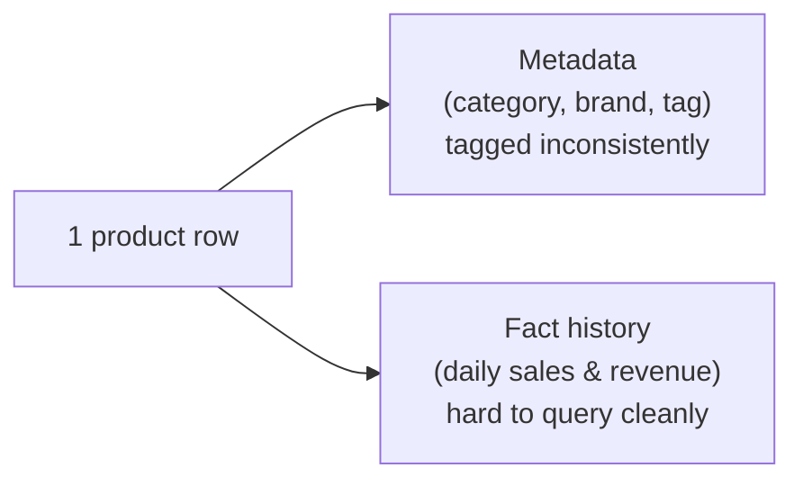

# 🚀 Data Analytics Portfolio

> **Role:** SENIOR DATA ANALYST | TECHNICAL & ANALYTICS  
> **Domains:** E-commerce, Logistics, Fintech, Telecommunications  
> **Core Stack:**
> - **Technical:** Advanced SQL (ClickHouse, PostgreSQL), Python, Machine Learning, Generative AI (LLM)
> - **BI & Analytics:** Power BI Data Modeling (Star Schema, Relationships, DAX, Performance Optimization), Metabase, Looker, A/B Testing

Welcome to my portfolio! This repository contains a curated selection of real-world business cases I have architected and executed. My work focuses on bridging the gap between chaotic raw data and revenue-driving business intelligence.

---

## 📁 Featured Projects

### 1. [FMCG E-Commerce Market Research Pipeline](./FMCG_EComerce_Market_Research/)
*Automating market intelligence and reporting for Enterprise FMCG brands.*
- **Data Reality (Before):**

| Product table today | My responsibility |
|---|---|
| **Metadata** (category, brand, tag) is tagged inconsistently across products. | Make sure products are tagged correctly by category/brand. |
| **Fact history** (years of sales data) is stored in a way that's hard to query cleanly. | Make sure every query pulls correct and complete data. |
- **Highlights:** Engineered an end-to-end data pipeline to parse millions of rows of this chaotic data. Built a **Hybrid Tagging Engine (Rule-based + Azure OpenAI GPT)** to standardize product taxonomies, plus automated QC gates (revenue drift, duplicate keys, combo integrity) before any figure reached a client.
- **Power BI Data Modeling:** Built the star schema (fact/dim relationships) directly in Power BI, authored the DAX measures behind every KPI, and optimized model performance (relationship cardinality, query folding, aggregations) so dashboards stayed responsive despite large data volumes.
- **Impact:** Delivered automated Excel reports, Power BI dashboards, and market research reports to 5 major enterprise clients, backed by verified data that supported their "Top 1 Brand" Market Certificates.

### 2. [MCN & Shop Live Performance Dashboard](./MCN_Shop_Live_Performance_Dashboard/)
*Optimizing livestream E-commerce ROI through advanced product segmentation.*
- **Highlights:** Transformed heavily nested, fragmented JSON API payloads into structured analytical data marts. Designed a **4-quadrant Product Performance Matrix** based on traffic and GMV efficiency.
- **AI-Assisted Workflow:** Used **MCP (Model Context Protocol)** to connect AI agents directly to ClickHouse and Power BI, letting the AI query/transform data marts and adjust the semantic model under my direction — speeding up iteration on the matrix logic and dashboard build.
- **Impact:** Provided MCNs with market-driven product recommendations, serving as a Unique Selling Proposition (USP) that significantly increased B2B deal win rates.

### 3. [TikTok Creator Discovery Tool](./Tiktok_Creator_Discovery_Tool/)
*Connecting brands with high-converting KOLs in the social commerce space.*
- **Highlights:** Researched TikTok creator and video metrics to design a cascade tagging algorithm.
- **AI-Assisted Workflow:** Used **MCP (Model Context Protocol)** to connect AI agents directly to ClickHouse and Power BI, offloading repetitive querying and model updates to AI while I directed the cascade tagging logic and validated results.
- **Impact:** Built a matchmaking tool that automates the discovery process, allowing clients to identify and partner with the most relevant creators for their specific target audiences.

### 4. [Keyword Search Share Tracker](./Keyword_Search_Share_Tracker_Project/)
*Monitoring E-commerce search visibility and marketing efficiency.*
- **Highlights:** Developed an automated system to scrape, parse, and track keyword rankings on marketplaces.
- **Impact:** Provided brands with clear visibility into their Organic vs. Sponsored Search Share, directly influencing their marketing and ad-spend budget allocations.

### 5. [Logistics & Fintech COD Credit Scoring Model](./Logistics_Fintech_COD_Credit_Scoring_Model/)
*Driving cross-selling strategies through shop behavioral data.*
- **Highlights:** Analyzed historical logistics and Cash-On-Delivery (COD) data to build shop behavioral segmentation models.
- **Impact:** Scored and determined credit limit eligibility for E-commerce sellers, successfully supporting financial product launches in collaboration with major Fintech partners (VPBank, VIB, HomeCredit).

---

*Note: All data within these project repositories is synthetic, anonymized, or heavily aggregated to comply with strict confidentiality agreements. No real business figures or sensitive client information are exposed.*
